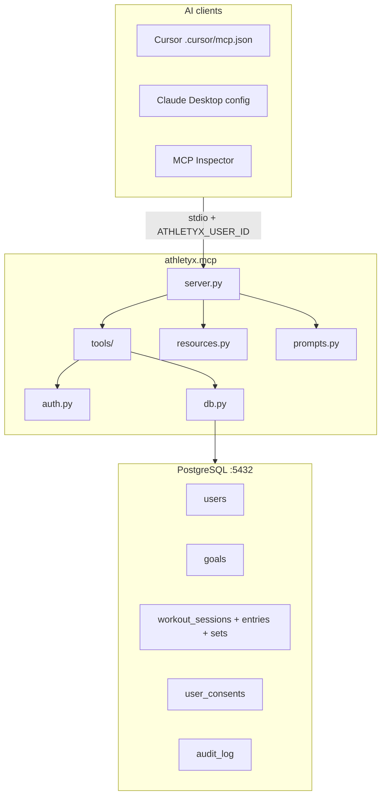

# Athletyx MCP — Architecture Map

App-store grade MCP server: **20 tools**, **10 resources**, **5 prompts** over stdio.

Full specification: [`docs/athletyx-mcp-app-store-spec.md`](../docs/athletyx-mcp-app-store-spec.md)

---

## System overview



---

## Directory map

```
athletyx.mcp/
├── server.py              # FastMCP entry — registers tools, resources, prompts
├── auth.py                # ATHLETYX_USER_ID scoping + admin gate
├── db.py                  # Parameterized SQL + audit logging
├── models.py              # Pydantic response models
├── resources.py           # Legal, policy, catalog URIs
├── prompts.py             # Coaching & safety prompt templates
├── schema.sql             # Phase 1 tables + seeds
├── bootstrap.py           # Local Postgres setup
├── setup_db.py            # Apply schema
├── tools/
│   ├── identity.py        # Profile, consent, admin lookups
│   ├── workouts.py        # Sessions, sets, exercise search
│   ├── goals.py           # Goals + goal contract
│   ├── coaching.py        # Workout generation (consent-gated)
│   ├── compliance.py      # Audit log
│   ├── workout_logic.py   # Deterministic parser/generator
│   └── helpers.py         # ToolResult envelopes
└── content/
    └── exercises.json     # Exercise catalog resource
```

---

## User scoping

Clients must set `ATHLETYX_USER_ID` in the MCP env block. Cross-user `search_users_by_profile` requires `ATHLETYX_ADMIN=true`.

---

## MCP surface (Phase 1)

### Tools (20)

| Domain | Tools |
|--------|-------|
| Identity | `get_current_user_profile`, `update_profile_preferences`, `get_consent_status`, `update_consent`, `get_data_inventory`, `get_user_by_id`, `get_user_by_email`, `search_users_by_profile` |
| Workouts | `get_workout_sessions`, `get_workout_session_detail`, `create_workout_session`, `log_exercise_sets`, `parse_raw_workout_log`, `search_exercise_library` |
| Goals | `get_active_goals`, `create_goal`, `complete_goal`, `get_goal_contract` |
| Coaching | `generate_workout_routine` |
| Compliance | `get_audit_log` |

### Resources (10)

`athletyx://legal/*`, `athletyx://privacy/*`, `athletyx://guardian/policy`, `athletyx://ai/safety-rails`, `athletyx://analytics/methodology`, `athletyx://exercises/catalog`

### Prompts (5)

`coaching-with-goal-contract`, `health-safe-coaching`, `post-workout-debrief`, `refusal-medical-advice`, `guardian-drift-review`

---

## Quick start

```bash
cd athletyx.mcp
python3 -m pip install -r requirements.txt
python3 bootstrap.py
```

Cursor: reload MCP after editing `.cursor/mcp.json` (includes `ATHLETYX_USER_ID`).

Inspector:

```bash
npx @modelcontextprotocol/inspector \
  -e ATHLETYX_USER_ID=1 \
  -e DB_HOST=localhost -e DB_PORT=5432 \
  -e DB_NAME=postgres -e DB_USER=postgres -e DB_PASSWORD=postgres \
  python3 server.py
```
