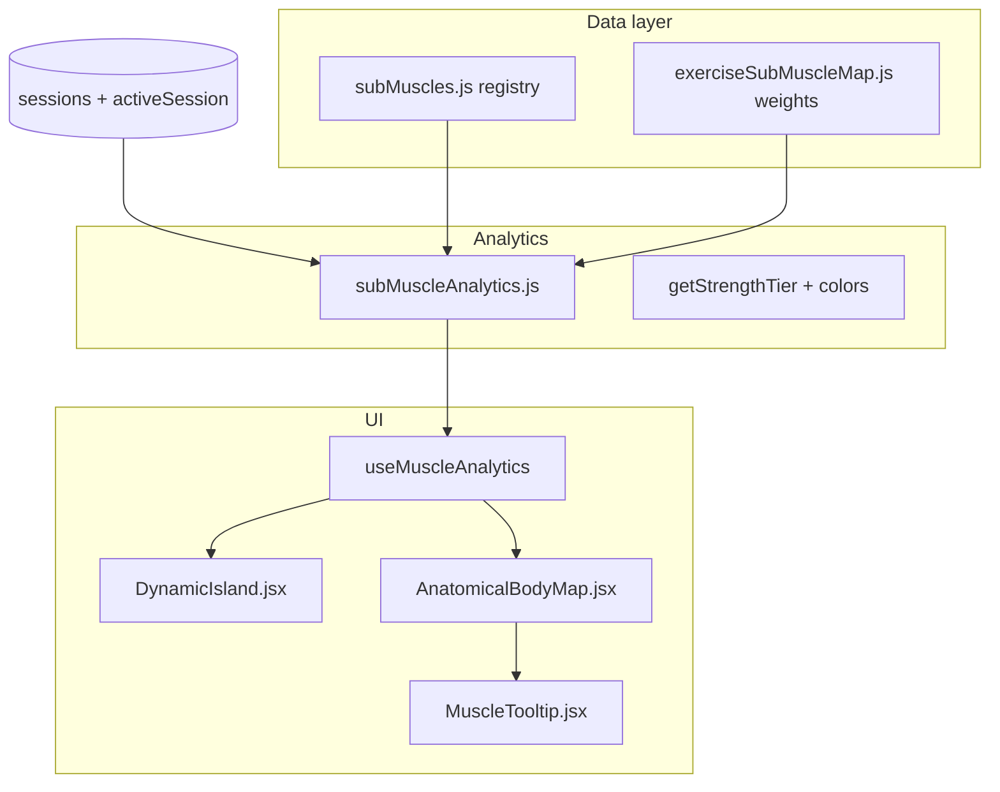

# IronLog: Dynamic Island + Sub-Muscle Heat Map

## Context

IronLog is **React 19 + Vite + Tailwind v4 + Framer Motion** ([`package.json`](package.json)). Workouts are **session objects** with `exercises[].sets[]` ([`src/utils/session.js`](src/utils/session.js)). Muscle analytics today are **coarse** (`Chest`, `Shoulders`, etc.) via [`src/utils/muscleBalance.js`](src/utils/muscleBalance.js) and a **card grid** on [`src/pages/AITrainer.jsx`](src/pages/AITrainer.jsx) — not an anatomical map on [`src/pages/Home.jsx`](src/pages/Home.jsx).

This plan adds granular sub-muscle tracking without breaking existing flows.

---

## 1. Sub-muscle data model (extensible registry)

**New:** [`src/data/subMuscles.js`](src/data/subMuscles.js)

- Export `SUB_MUSCLES`: array of `{ id, label, parentGroup, view: 'front' | 'back' | 'both', svgPathId }`
- Cover required granularity (examples):
  - **Delts:** `deltoid_anterior`, `deltoid_lateral`, `deltoid_posterior`
  - **Arms:** `biceps_long`, `biceps_short`, `brachialis`, `triceps_lateral`, `triceps_long`, `triceps_medial`
  - **Legs:** `gastrocnemius`, `soleus`, `rectus_femoris`, `vastus_lateralis`, `vastus_medialis`, `hamstrings_biceps_femoris`, `hamstrings_semitendinosus`
  - **Chest/back:** `pec_upper`, `pec_lower`, `lats`, `rhomboids`, `traps_lower`
- Export `SUB_MUSCLE_BY_ID`, `PARENT_GROUPS` for rollup labels

**New:** [`src/data/exerciseSubMuscleMap.js`](src/data/exerciseSubMuscleMap.js)

- Map each exercise name (from [`EXERCISE_DATABASE`](src/data/exercises.js)) to `{ subMuscleId: weight }` where weights sum to `1.0`
- Example: `Lateral Raise` → `{ deltoid_lateral: 0.85, deltoid_anterior: 0.15 }`
- Fallback for unknown exercises: distribute to parent `muscleGroup` via a default split table

This avoids rewriting all of [`exercises.js`](src/data/exercises.js) while keeping extension trivial (add one map entry per new lift).

---

## 2. Analytics & tier system

**New:** [`src/utils/subMuscleAnalytics.js`](src/utils/subMuscleAnalytics.js)

| Function | Purpose |
|----------|---------|
| `aggregateSubMuscleVolume(sessions, { days, includeActiveSession })` | Sum weighted volume per `subMuscleId` |
| `computeStrengthScores(volumeMap, sessions)` | Normalize each muscle to **0–100** vs user's rolling max / P90 in window (default 30d) |
| `getStrengthTier(score)` | Returns `{ tier, label, color }` using exact thresholds |
| `getSubMuscleImbalances(scores)` | Flags hit vs neglected (e.g. anterior delt high, posterior 0) |
| `getIslandSummary(analytics)` | Minimized pill text + status dots |
| `getCoachIslandInsight(analytics, analysis)` | 1–2 sentences for expanded AI block |
| `getMuscleTip(subMuscleId, score, sessions)` | Tooltip AI suggestion string |

**Tier colors (fixed constants):**

| Score | Tier | Color |
|-------|------|-------|
| 0–20 | neglected | `#EF4444` (red) |
| 21–65 | intermediate | `#F59E0B` (amber) |
| 66–85 | strong | `#4DF0FF` (diamond cyan) |
| 86–100 | elite | `#7C3AED` (violet) |

**Override:** zero volume in window → force **neglected** regardless of normalized score.

**Estimated 1RM for tooltip:** reuse PR logic from [`getPersonalRecords`](src/utils/calculations.js) on exercises that activate the sub-muscle (highest contributing lift).

**New hook:** [`src/hooks/useMuscleAnalytics.js`](src/hooks/useMuscleAnalytics.js)

- Reads `sessions`, `activeSession` from [`useApp`](src/hooks/useApp.js)
- Memoizes: `scores`, `todayHits`, `imbalances`, `islandSummary`, `coachInsight`
- Optionally calls `runFullAnalysis` from [`src/utils/aiAnalysis.js`](src/utils/aiAnalysis.js) for recovery/readiness line in expanded island

---

## 3. Dynamic Island header component

**New:** [`src/components/workout/DynamicIsland.jsx`](src/components/workout/DynamicIsland.jsx)

**Behavior:**

- `position: fixed; top: safe-area; z-50;` centered pill, max-width aligned with [`AppShell`](src/components/layout/AppShell.jsx) `max-w-lg`
- **Minimized:** pill ~48px height — label from `getIslandSummary` (e.g. `Today · Push bias`) + row of 6–8 micro-dots colored by parent-group status (hit / partial / neglected)
- **Expanded:** spring animation via Framer Motion (`layout`, `type: 'spring', stiffness: 380, damping: 32`):
  - AI insight paragraph (`getCoachIslandInsight`)
  - Scrollable sub-muscle grid grouped by region (Delts, Arms, Legs, etc.) with per-head status chips (hit / neglected / volume %)
  - Imbalance warnings (e.g. "4 sets anterior delt · 0 posterior")
  - **Minimize** button + backdrop tap to collapse
- Click outside / Escape closes expanded state

**Integration:** Mount in [`src/components/layout/AppShell.jsx`](src/components/layout/AppShell.jsx) above `{children}`, with `padding-top` offset on main content (`pt-14` or dynamic) so content is not hidden. Show on all tabs except when `hideNav` workout fullscreen — pass `showIsland={!hideNav}` from [`App.jsx`](src/App.jsx). During **active workout**, feed `activeSession` so live sets update dots in real time.

---

## 4. Homepage anatomical heat map

**New:** [`src/components/body/bodyPaths.js`](src/components/body/bodyPaths.js)

- SVG `<path>` definitions keyed by `subMuscleId` for **front** and **back** stylized silhouettes (simplified anatomy, not clinical — keeps bundle small and maintainable)

**New:** [`src/components/body/AnatomicalBodyMap.jsx`](src/components/body/AnatomicalBodyMap.jsx)

- Toggle or side-by-side **Front / Back** views (mobile: segmented control)
- Each path: `fill` from `getStrengthTier(score).color`, `opacity` 0.85, subtle stroke `slate-800`
- Hover (desktop) / tap (mobile) sets `activeMuscle` state
- `role="img"` + `aria-label` per region for accessibility

**New:** [`src/components/body/MuscleTooltip.jsx`](src/components/body/MuscleTooltip.jsx)

- Shows: muscle label, tier name, strength score / est. 1RM, volume in window, `getMuscleTip()` suggestion
- Positioned near cursor or anchored above selected path on mobile

**Update:** [`src/pages/Home.jsx`](src/pages/Home.jsx)

- Insert new section after [`GuardianReminder`](src/components/ai/GuardianReminder.jsx) and before quick-start CTA:
  - Heading: "Muscle development map"
  - `<AnatomicalBodyMap scores={...} onMuscleSelect={...} />`
  - Legend row for 4 tier colors
- Wire `useMuscleAnalytics()` at page level

**Optional retain:** Keep existing grid [`MuscleHeatMap`](src/components/ai/MuscleHeatMap.jsx) on AITrainer page unchanged (coarse view); optionally add link "View full body map on Home".

---

## 5. Styling & motion conventions

- Tailwind: `bg-zinc-950/90 backdrop-blur-xl border border-zinc-800/80 rounded-full` (island), `shadow-2xl shadow-black/40`
- Framer Motion already installed — no new deps
- No new chart libraries for this feature

---

## 6. Files touched (summary)

| Action | File |
|--------|------|
| Create | `src/data/subMuscles.js`, `src/data/exerciseSubMuscleMap.js` |
| Create | `src/utils/subMuscleAnalytics.js` |
| Create | `src/hooks/useMuscleAnalytics.js` |
| Create | `src/components/workout/DynamicIsland.jsx` |
| Create | `src/components/body/bodyPaths.js`, `AnatomicalBodyMap.jsx`, `MuscleTooltip.jsx` |
| Edit | `src/components/layout/AppShell.jsx` — island + content offset |
| Edit | `src/App.jsx` — pass `showIsland` / `workoutMode` flags |
| Edit | `src/pages/Home.jsx` — heat map section |

---

## 7. Verification

1. `npm run build` — no import errors
2. Log a session with lateral raises only → island warns posterior delt neglected; lateral delt path red/orange on map
3. Balanced push session → mixed dot colors; expanded grid shows per-head volumes
4. Active workout: add sets → minimized dots update without refresh
5. Tooltip shows tier + suggestion on hover/tap

---

## Out of scope (follow-up)

- Persisting sub-muscle history to Supabase (DEPLOYMENT.md schema is session-level only today)
- Voice / Athletyx integration
- Replacing coarse `analyzeMuscleBalance` (can later consume sub-muscle rollup)
