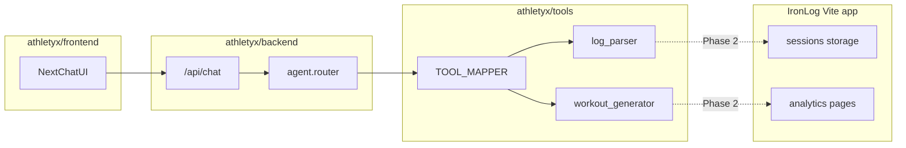

# Athletyx foundation scaffold (sibling to IronLog)

## Is this a good upgrade?

**Yes — as a foundational layer, not a full product swap yet.**

| Dimension | IronLog today | Athletyx direction |
|-----------|---------------|-------------------|
| UX philosophy | Multi-page app + charts + forms + embedded chat ([`src/pages/AITrainer.jsx`](src/pages/AITrainer.jsx)) | Single conversational surface; complexity hidden behind tools |
| AI architecture | Client-side keyword routing in [`src/services/aiService.js`](src/services/aiService.js) | Server-side tool registry + schemas ready for real LLM function calling |
| Extensibility | Hard to add new capabilities without new UI | New capability = new tool + schema; UI stays one input bar |
| Risk | Lower (everything in one Vite app) | Two runtimes (Python + Next.js), CORS, deploy split until unified |

**Recommendation:** Treat Athletyx as the **interaction shell** and keep IronLog as the **data/rich-output layer** until `log_parser` persists real sessions and workout tools feed live analytics. That matches your sibling choice and avoids throwing away [`src/utils/calculations.js`](src/utils/calculations.js), guardian logic, and session models.



---

## Target layout (new files only under `athletyx/`)

```
athletyx/
├── requirements.txt
├── README.md
├── tools/
│   ├── __init__.py          # ALL_ATHLETYX_TOOLS, TOOL_MAPPER
│   ├── workout_generator.py
│   └── log_parser.py
├── backend/
│   ├── main.py              # FastAPI app, CORS, POST /api/chat
│   └── agent.py             # route_message(), execute_tool(**kwargs)
└── frontend/
    ├── package.json
    ├── next.config.ts
    ├── tailwind.config.ts
    ├── postcss.config.mjs
    ├── tsconfig.json
    ├── app/
    │   ├── layout.tsx
    │   ├── page.tsx         # full-screen chat
    │   └── globals.css
    └── components/
        ├── ChatViewport.tsx
        └── ChatInput.tsx    # glowing bar + mic icon (layout only)
```

IronLog at repo root stays untouched.

---

## 1. Python tools layer

### [`athletyx/tools/workout_generator.py`](athletyx/tools/workout_generator.py)

- `MOCK_ROUTINES`: nested dict `goal -> split -> markdown str` for:
  - goals: `hypertrophy`, `strength`
  - splits: `push`, `pull`, `legs`
- `generate_workout_routine(fitness_goal: str, target_split: str) -> str`
  - Normalize inputs (lowercase, strip)
  - Return markdown routine or a friendly fallback string
- `workout_tool_schema`: OpenAI-style function dict:

```python
{
  "type": "function",
  "function": {
    "name": "generate_workout_routine",
    "description": "...",
    "parameters": {
      "type": "object",
      "properties": {
        "fitness_goal": {"type": "string", "enum": ["hypertrophy", "strength"]},
        "target_split": {"type": "string", "enum": ["push", "pull", "legs"]},
      },
      "required": ["fitness_goal", "target_split"],
    },
  },
}
```

### [`athletyx/tools/log_parser.py`](athletyx/tools/log_parser.py)

- `parse_raw_workout_log(raw_text: str) -> str`
  - Regex/heuristic parse for patterns like `bench 225 for 8, 8, 6`
  - Return human-readable confirmation (exercise, weight, sets/reps list, estimated volume)
- `log_tool_schema` with single required `raw_text` string param

### [`athletyx/tools/__init__.py`](athletyx/tools/__init__.py)

```python
ALL_ATHLETYX_TOOLS = [workout_tool_schema, log_tool_schema]
TOOL_MAPPER = {
  "generate_workout_routine": generate_workout_routine,
  "parse_raw_workout_log": parse_raw_workout_log,
}
```

---

## 2. Backend router

### [`athletyx/backend/agent.py`](athletyx/backend/agent.py)

- `execute_tool(name: str, arguments: dict) -> str`
  - Lookup `TOOL_MAPPER[name]`, `return fn(**arguments)` with try/except → error string
- `route_message(user_text: str) -> dict`
  - **Phase 1 (simulated routing):** keyword/intent rules, e.g.:
    - contains `bench|squat|hit|for` + digits → `parse_raw_workout_log(raw_text=user_text)`
    - contains `workout|routine|plan` + split words → `generate_workout_routine(...)`
    - default → assistant message listing example commands
  - Return JSON: `{ "role": "assistant", "content": str, "tool_used": str | null, "tool_args": dict | null }`

### [`athletyx/backend/main.py`](athletyx/backend/main.py)

- FastAPI app with:
  - `CORSMiddleware` allowing `http://localhost:3000` (Next dev)
  - Pydantic models: `ChatRequest { message: str }`, `ChatResponse { ... }`
  - `POST /api/chat` → `await` sync `route_message` (or `run_in_executor` if needed)
  - `GET /health` for smoke tests
- Run via: `uvicorn backend.main:app --reload --app-dir athletyx` (document in README)

### [`athletyx/requirements.txt`](athletyx/requirements.txt)

```
fastapi>=0.115.0
uvicorn[standard]>=0.32.0
pydantic>=2.0.0
```

---

## 3. Premium Next.js frontend

Scaffold with **Next.js 15 App Router + TypeScript + Tailwind** (user spec said minimalist chat; TS is standard for `create-next-app` — JS variant optional if you prefer).

### Design tokens ([`athletyx/frontend/app/globals.css`](athletyx/frontend/app/globals.css))

- `bg-slate-950`, `text-slate-50`, `border-slate-800/60`
- Subtle radial gradient backdrop (no charts/sidebars)
- Custom `.input-glow` ring on focus (emerald/cyan at low opacity)

### [`athletyx/frontend/app/page.tsx`](athletyx/frontend/app/page.tsx)

- Full viewport column: header (Athletyx wordmark + one-line tagline), `ChatViewport`, fixed bottom `ChatInput`
- State: `messages: { id, role, content }[]`, `isLoading`
- `sendMessage()` → `fetch('http://127.0.0.1:8000/api/chat', { method: 'POST', body: JSON.stringify({ message }) })`
- Append user bubble, then assistant bubble from response
- Empty state: 2–3 suggested prompts (e.g. "Plan a hypertrophy push day", "hit bench 225 for 8, 8, 6")

### Components

- **ChatViewport:** scrollable message list, user right-aligned / assistant left, fade-in, no avatars clutter
- **ChatInput:** single rounded-full bar, send on Enter, mic icon button (disabled/tooltip "Voice coming soon" — layout only per spec)

### Config

- `next.config.ts`: optional `rewrites` to proxy `/api/chat` → backend in production later
- Env: `NEXT_PUBLIC_API_URL=http://127.0.0.1:8000`

---

## 4. Integration & verification (post-scaffold)

1. **Backend:** `cd athletyx && python -m venv .venv && pip install -r requirements.txt && uvicorn backend.main:app --reload`
2. **Frontend:** `cd athletyx/frontend && npm install && npm run dev`
3. **Smoke tests:**
   - `POST /api/chat` with log phrase → structured confirmation
   - `POST /api/chat` with "hypertrophy push routine" → markdown workout
   - UI sends both flows end-to-end

---

## 5. What we will NOT do in this scaffold (defer to Phase 2)

- Wire `log_parser` into IronLog [`src/context/AppContext.jsx`](src/context/AppContext.jsx) session storage
- Real OpenAI/Anthropic tool-calling loop (schemas are ready; router stays rule-based)
- Voice capture (mic is visual only)
- Single deploy artifact (document separate Vercel + Railway/Fly for now in [`athletyx/README.md`](athletyx/README.md))

---

## Deliverables after implementation

- Complete, runnable `athletyx/` tree with all files populated (no placeholders)
- Root-level note in [`athletyx/README.md`](athletyx/README.md): how to run both servers + example curl
- Build verification: `npm run build` in frontend; import check for Python modules
