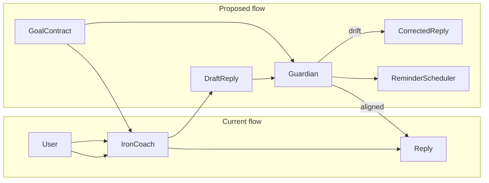
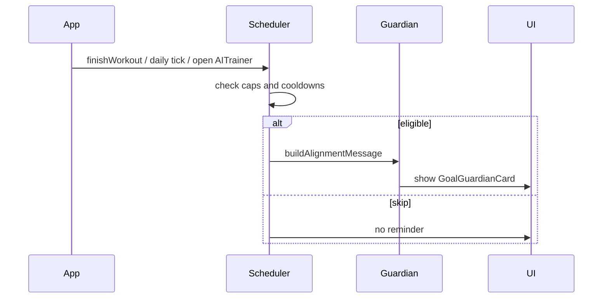

# Goal Guardian — Supervisor AI Plan

## Problem today

[IronCoach](src/utils/aiPrompts.js) only receives training analytics in `buildSystemContext()`—not `profiles.fitness_goal`, active `goals`, or constraints. The coach can answer off-topic questions (e.g. random bro-science) without accountability.



## Architecture: two-layer AI (one visible coach)

| Layer | Role | Name in UI |
|-------|------|------------|
| **Coach** | Training advice, workouts, recovery | IronCoach (existing chat) |
| **Guardian** | Goal enforcement, drift detection, reminders | "Goal Guardian" card only—no second chat |

Guardian runs **client-side heuristics first** (fast, free, offline-capable). Optional LLM review stays behind the same `aiService.js` hook pattern already prepared for OpenAI/Claude later.

---

## 1. Goal Contract (single source of truth)

New module: [`src/utils/goalContract.js`](src/utils/goalContract.js)

Build a structured contract from:

- [`profiles`](supabase/schema.sql): `fitness_goal`, `experience_level`, `bodyweight`
- Active rows in [`goals`](supabase/schema.sql): `title`, `target`, `completed = false`
- User-editable constraints (new JSON on profile): e.g. injuries, "focus: strength not cardio", weekly session target

Output example:

```js
{
  primaryGoal: "Build muscle — upper body emphasis",
  activeGoals: [{ title: "Bench 225", target: "by June" }],
  constraints: ["No high-impact cardio", "3 lifts/week max"],
  keywords: ["hypertrophy", "bench", "press", "pull", ...]  // for drift matching
}
```

**UI additions** (small, high impact):

- [Profile](src/pages/Profile.jsx): required **Primary fitness goal** field → `profiles.fitness_goal`
- [Settings](src/pages/Settings.jsx): Guardian reminder toggles + quiet hours inside existing `notification_preferences` JSON

---

## 2. Guardian analysis engine

New files:

| File | Responsibility |
|------|----------------|
| [`src/utils/guardianAnalysis.js`](src/utils/guardianAnalysis.js) | Drift score, topic classification, training-vs-goal alignment |
| [`src/utils/reminderScheduler.js`](src/utils/reminderScheduler.js) | Frequency caps, cooldowns, eligibility |
| [`src/services/guardianService.js`](src/services/guardianService.js) | Orchestration: pre-check, post-check, log, schedule reminders |

### Drift detection (heuristic, no LLM required)

Score each IronCoach reply 0–100:

- **Topic drift**: reply lacks goal-related keywords for 2+ turns while user asks non-training topics (travel, politics, etc.)
- **Goal contradiction**: advice opposes contract (e.g. goal = cut, coach pushes aggressive bulk surplus without context)
- **Analytics sidetrack**: long reply with zero reference to user's active goals when user asked a narrow question
- **Muscle mismatch**: existing [`muscleBalance.js`](src/utils/muscleBalance.js) flags vs primary goal (e.g. leg goal but 80% push volume)

Thresholds:

- `score < 30` → aligned, pass through
- `30–60` → soft warning inline in chat ("Guardian: this may drift from your goal—want a goal-focused answer?")
- `> 60` → regenerate with stricter Guardian prompt OR append goal-focused correction paragraph

### Preemption (cheaper than post-fix)

Extend [`buildSystemContext`](src/utils/aiPrompts.js) and add `buildGuardianConstraints(contract)`:

```
GOAL CONTRACT (non-negotiable):
- Primary: {fitness_goal}
- Active goals: ...
RULES: Stay on contract. Decline off-topic requests politely. Redirect to training.
```

Inject into every `sendChatMessage()` call in [`aiService.js`](src/services/aiService.js).

---

## 3. Reminder frequency (recommended cadence)

Design principle: **high signal, low noise** — max **2 in-app reminders per day**, **5 per week**, respect quiet hours.

| Trigger | When | Frequency | Cooldown | Rationale |
|---------|------|-----------|----------|-----------|
| **Post-workout alignment** | After `finishWorkout()` in [`AppContext.jsx`](src/context/AppContext.jsx) | At most **1× per day** | 12h | Highest intent moment; tie advice to session just logged |
| **Weekly goal review** | User's preferred day (default Sunday 6pm local) | **1× per week** | 6 days | Reflect on progress without daily nagging |
| **Drift streak** | 3+ Guardian warnings in same chat session | **1 reminder** | 48h | Only when coach repeatedly sidetracks |
| **Inactivity nudge** | No workout 3+ days + incomplete active goals | **1×** | 72h | Re-engagement without spam |
| **Daily check-in** (optional, off by default) | Morning window | **1× per day** | 24h | Power users opt in via Settings |

**Never send:**

- Reminders during active workout mode
- More than one reminder within 4 hours
- Any reminder if user dismissed 2 in a row (7-day snooze)

Scheduler logic lives in [`reminderScheduler.js`](src/utils/reminderScheduler.js): reads `last_reminder_at`, `reminder_count_week`, `notification_preferences` from profile or new lightweight table.



---

## 4. Database (Supabase extension)

Add to [`supabase/schema.sql`](supabase/schema.sql) (migration snippet):

**`guardian_checks`** — audit log per review

- `user_id`, `check_type` (pre_prompt | post_response | scheduled)
- `drift_score`, `aligned` (bool), `coach_excerpt`, `payload` jsonb, `created_at`

**`guardian_reminders`** — sent reminders + cooldown

- `user_id`, `reminder_type`, `message`, `sent_at`, `dismissed_at`

Extend `profiles.notification_preferences` schema (documented, not new table):

```json
{
  "guardian_enabled": true,
  "weekly_review_day": 0,
  "quiet_hours": { "start": 22, "end": 7 },
  "daily_checkin": false
}
```

RLS: same pattern as existing tables (`auth.uid() = user_id`).

Persist checks when cloud auth is enabled via [`workoutService.js`](src/services/workoutService.js) or new `guardianService` Supabase helpers.

---

## 5. UI integration (supervisor only)

| Location | Change |
|----------|--------|
| [AITrainer](src/pages/AITrainer.jsx) | New collapsible **Goal Guardian** section above chat: alignment score, last check, weekly reminder |
| [AITrainerChat](src/components/ai/AITrainerChat.jsx) | Inline drift badge on flagged coach messages; optional "Refocus on my goals" button |
| [Home](src/pages/Home.jsx) | Small reminder toast/card when scheduler fires (dismissible) |
| Post-workout modal | One-line Guardian note in [`SessionSummaryModal`](src/components/workout/SessionSummaryModal.jsx) if session misaligned with goals |

New components:

- `src/components/ai/GoalGuardianCard.jsx` — alignment ring + last insight
- `src/components/ai/GuardianReminder.jsx` — dismissible banner

---

## 6. Service wiring (minimal churn)

Update [`sendChatMessage`](src/services/aiService.js):

1. Load `goalContract` from context (profile + goals via `useAuth` / `useApp`)
2. `buildChatPrompt(message, analysis, contract)` — Guardian constraints prepended
3. After `generateCoachResponse`, run `guardianService.reviewReply(reply, contract, history)`
4. Return corrected or annotated reply

Hook [`finishWorkout`](src/context/AppContext.jsx) → `guardianService.maybePostWorkoutReminder(session, contract)`.

On app foreground / AITrainer mount: `reminderScheduler.tick(userId, contract)` (cheap date math, no background workers required for v1).

---

## 7. Implementation phases

**Phase A — Goal awareness (foundation)**  
Goal Contract util, profile goal UI, inject contract into IronCoach prompts.

**Phase B — Guardian review**  
Drift heuristics, inline chat warnings, `guardian_checks` logging.

**Phase C — Smart reminders**  
Scheduler with table above, Home + AITrainer banners, Settings toggles.

**Phase D (optional)**  
LLM-based Guardian review when API key present; stricter regeneration on high drift.

---

## 8. What stays unchanged

- All existing workout session, PR, analytics, 7-day load, and IronCoach analytics sections
- Offline localStorage cache + Supabase sync pattern in [`AppContext.jsx`](src/context/AppContext.jsx)
- No second chat thread (per your choice)

---

## 9. Success metrics (for tuning frequency later)

Track in `guardian_reminders` / `guardian_checks`:

- Reminder dismiss rate (target: &lt; 40% dismiss without read)
- Drift score trend over time (should decrease after Phase A)
- % of post-workout reminders acted on (started workout within 48h)

Adjust cooldowns in [`reminderScheduler.js`](src/utils/reminderScheduler.js) constants only—no UI rewrite needed.
