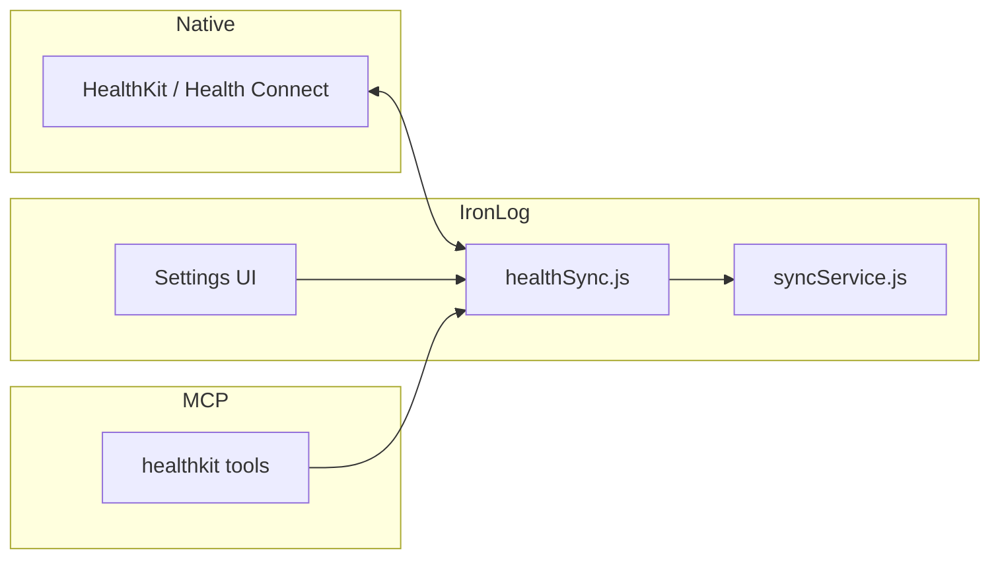

# Stage 08 — Health platform integration

## Scope

- **iOS:** Apple HealthKit workout samples (read + write finished sessions)
- **Android:** Google Health Connect equivalent
- **App:** Settings toggle, import on app foreground, export on workout finish
- **MCP:** `sync_healthkit_workouts` / `get_healthkit_status` return live state

## Architecture

## Verification

- Settings shows correct platform (`ios` / `android` / `web`)
- Toggle persists in `localStorage`
- MCP tools return `available: true` after native plugin ships
